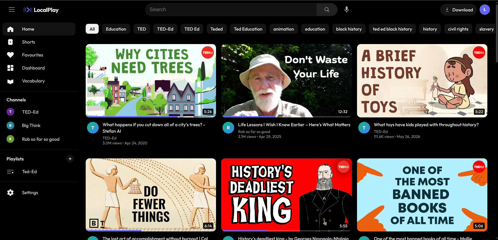

<h1 align="center">
  <br>
  LocalPlay
  <br>
</h1>

<p align="center">
  
</p>

<h4 align="center">An open-source, self-hosted media platform built with learning and privacy in mind.</h4>

<p align="center">
  <a href="#about">About</a> •
  <a href="#features">Features</a> •
  <a href="#how-it-works">How It Works</a> •
  <a href="#installation">Installation</a> •
  <a href="#license">License</a>
</p>

## About

**LocalPlay** is a self-hosted web application that lets you download, organize, and stream media locally without relying on external algorithms or dealing with advertisements. It's built for those who want total control over their media library, with built-in tools designed specifically for students, language learners, and hobbyists.

> [!IMPORTANT]
> **Local-First Design:** LocalPlay is NOT a direct streaming service. It operates entirely on your local files. You must download videos using the integrated tool first before they appear in your library for viewing and study.

By hosting LocalPlay yourself, your viewing history, playlists, and study notes remain entirely on your machine. We use a custom, privacy-respecting architecture that keeps your data local.

## Features

* **Locally Hosted:** Your data, your server. No tracking, no ads.
* **Built-In Downloader:** Seamlessly fetch videos directly into your library.
* **Educational Tools:** Take time-stamped study notes on videos.
* **Language Learning:** Generate spaced-repetition vocabulary flashcards straight from video subtitles.
* **Custom Playlists:** Curate and organize your videos exactly how you want them.
* **Algorithmic Freedom:** An internal, transparent algorithm scores and recommends videos based on *your* interactions, not what a corporation wants you to see.
* **Distraction-Free Shorts:** A scrollable vertical feed tailored for short-form content.

## How It Works

LocalPlay is built on a split architecture for maximum performance:
* **The Backend** is powered by Python and FastAPI, handling the heavy lifting of downloading media (via `yt-dlp`), serving video chunks to the player, and managing the SQLite database.
* **The Frontend** is a snappy, lightweight React SPA (Single Page Application) that gives you a modern, app-like experience in your browser.

## Installation

Getting LocalPlay up and running is designed to be as simple as possible.

### Prerequisites
* Python 3.10+
* Node.js & npm

### Quick Start
1. **Clone the repository:**
   ```bash
   git clone https://github.com/esterzollar/LocalPlay.git
   cd LocalPlay
   ```
2. **Run the startup script:**
   ```bash
   ./run.sh
   ```
   *The script will automatically set up your Python virtual environment, install Node dependencies, and start both the backend and frontend.*

3. **Enjoy!**
   Open your browser and navigate to `http://localhost:12955`.

## License

LocalPlay is distributed under the **LocalPlay Public License (LPL)**.

We believe in empowering individuals. As an individual, hobbyist, or fellow open-source creator, you are free to use this software without restriction, provided you are not using it for profit. 

**Key License Points:**
* **Free for Non-Commercial Use:** You can use and modify this project freely.
* **Attribution is Required:** If you use our code, you must credit this LocalPlay.
* **No Forced Open Source:** You don't have to open-source your derivative work, but you cannot sell it or use it for profitable purposes.

Please read the full [LICENSE](LICENSE) file for exact terms.
